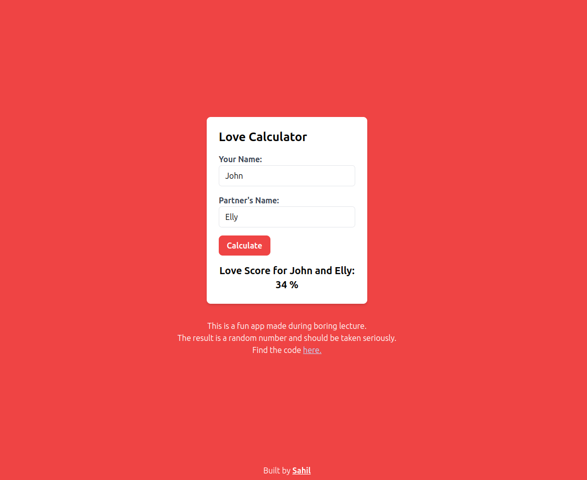

# Love Calculator

This is a simple web app that calculates a "love score" between two people based on their names. The result is a random number and should be taken in a fun, light-hearted manner.

## Features

- Input fields for entering your name and your partner's name.
- Calculate button to generate a love score.
- Result displayed below the button.
- Fun app made during a boring lecture.

## Usage

1. Enter your name in the "Your Name" field.
2. Enter your partner's name in the "Partner's Name" field.
3. Click the "Calculate" button to see your love score.

## Preview

## Live Demo

Try the [Love Calculator](https://your-live-demo-url.com) live!

## Code

The code for this app is available on [GitHub](https://github.com/Sxhil296/loveCalculatorDemo).
